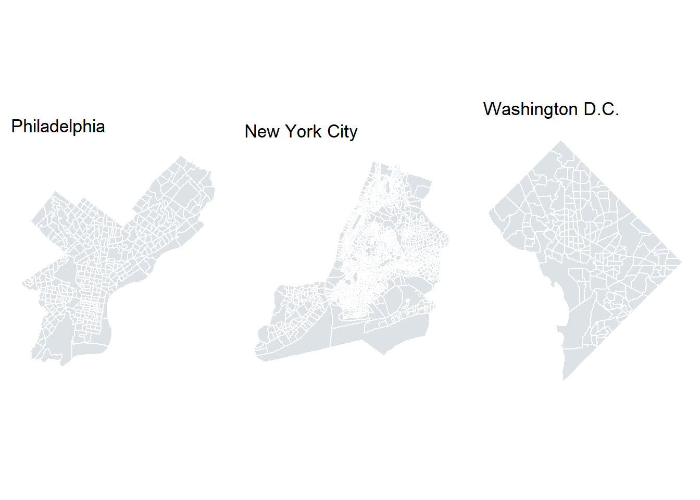
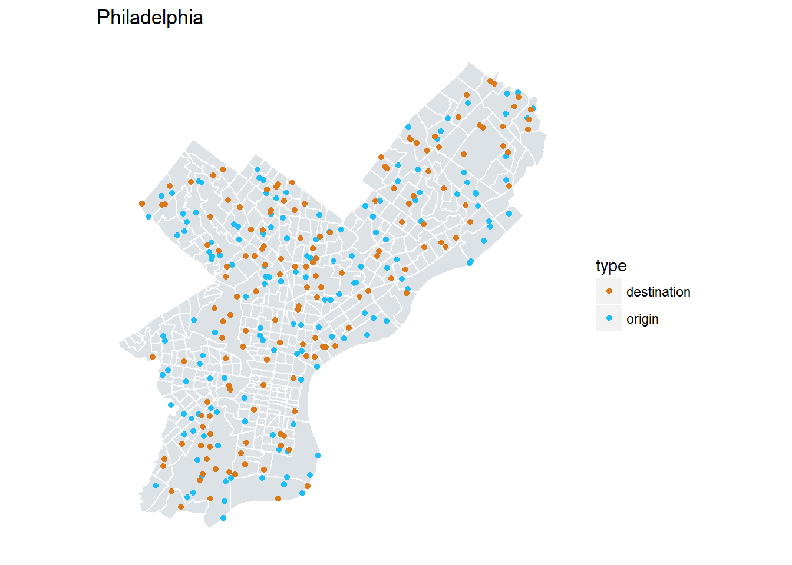
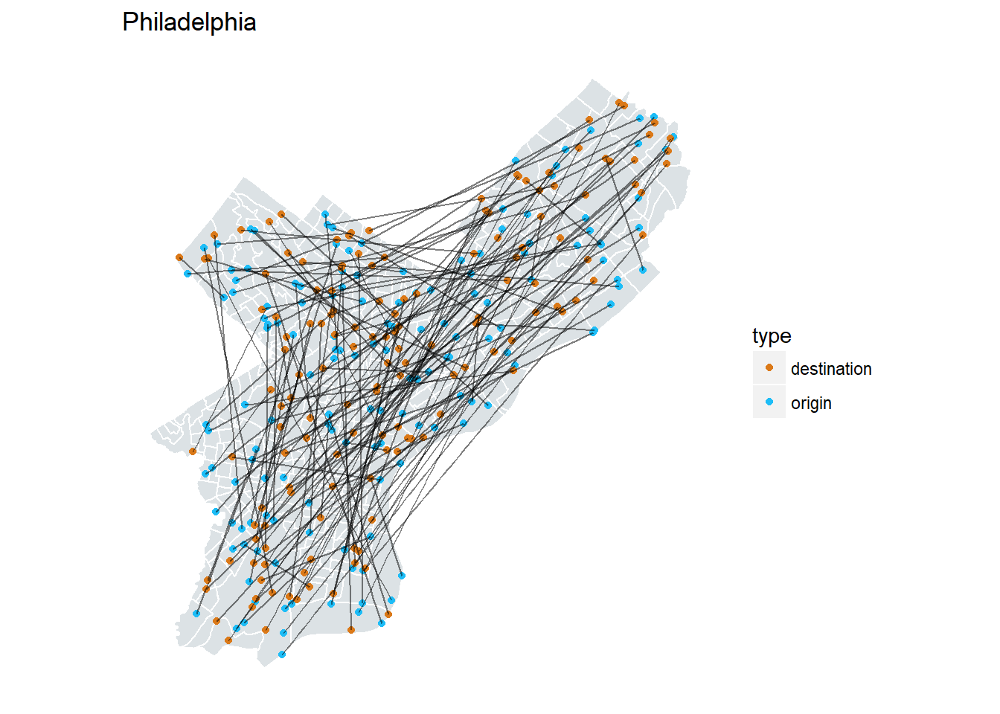
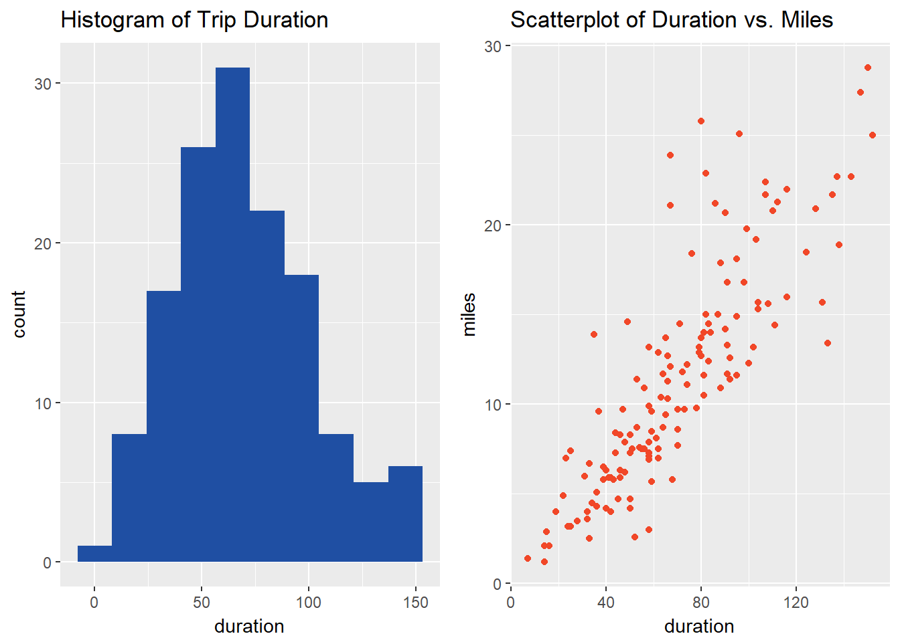

#Part 2: Shapefiles and Progress

The main lesson from part 1 is that I'm going to have to be a little less lazy in this project. The minitua is that I needed:
 
   1. a way to graph only the city limits itself  
   2.  a way to generate random points within that irregular polygon

Googling told me that what I needed was a shapefile, "The shapefile format is a popular geospatial vector data format for geographic information system (GIS) software...The shapefile format can spatially describe vector features: points, lines, and polygons, representing, for example, water wells, rivers, and lakes."[^1]

At first, it looked like this required me to download a bunch of files from the internet and load them all into R. At first because of the blessed package Tigris which allows users to download shapefiles from the US Census Bureau.

The below code is using the TIGRIS package to grab the files for Philadelphia, New York City, and Washington D.C.


```r
library(tigris)
library(sp)
philly <- tracts(state = "PA", county = "Philadelphia")
ny <- tracts(state = "NY", 
         county = c("New York County", "Bronx County",
                  "Kings County", "Queens County", "Richmond County")  )

dc <- tracts(state = "District of Columbia")
```



Okay great - we have our city polygons.

## Getting Random Points
To work with the shapefiles in R, the package `sp` was used. This package has a great function `spsample` which magically spits out the random numbers. At first, I still thought I'd have to figure out how to divide the cities into shapes I could find random points within then recombine.

I thought a good starting point would be to get 300 points, 150 origin and 150 destination, and find the directions between them. I'll show an example of that workflow using only Philadelphia.


```r
number_sample <- 150  #This is the number of trips we want to test
city_file <- philly #This is what city to get points for

origin <- spsample(city_file, n = number_sample, "random") %>%
  as.data.frame()
origin <- origin %>%
  select(startLat = y , startLon = x) %>%
  mutate(trip_id = 1:nrow(origin))


destination <- spsample(city_file, n = number_sample, "random") %>%
  as.data.frame()
destination <- destination %>%
  select(endLat = y , endLon = x) %>%
  mutate(trip_id = 1:nrow(destination))

#To combine the origins and destinations
trip <- left_join(origin,destination,by = "trip_id") %>%
  select(trip_id,startLat, startLon, endLat, endLon)
```

<!--html_preserve--><div id="htmlwidget-607331c0b3bd79d94cc2" style="width:100%;height:auto;" class="datatables html-widget"></div>
<script type="application/json" data-for="htmlwidget-607331c0b3bd79d94cc2">{"x":{"filter":"none","data":[["1","2","3","4","5","6","7","8","9","10","11","12","13","14","15","16","17","18","19","20","21","22","23","24","25","26","27","28","29","30","31","32","33","34","35","36","37","38","39","40","41","42","43","44","45","46","47","48","49","50","51","52","53","54","55","56","57","58","59","60","61","62","63","64","65","66","67","68","69","70","71","72","73","74","75","76","77","78","79","80","81","82","83","84","85","86","87","88","89","90","91","92","93","94","95","96","97","98","99","100","101","102","103","104","105","106","107","108","109","110","111","112","113","114","115","116","117","118","119","120","121","122","123","124","125","126","127","128","129","130","131","132","133","134","135","136","137","138","139","140","141","142","143","144","145","146","147","148","149","150"],[39.9786833386486,40.0610651498318,40.0192329345826,40.0181541860451,40.0198252339995,39.975793886497,39.9850867322027,40.0572737127116,40.1048889130779,40.0493658230212,39.9237307636254,40.0676809138504,39.9542611677981,40.1198336438295,40.1106722466019,39.8829785372218,39.9539477428991,39.9836529514124,39.9705922608741,40.0189479043316,39.8964060785867,39.9533073506012,39.9094292962152,40.0616058633404,40.0402226477459,39.9426950193223,39.985708835479,39.9347800473587,40.0420272527902,39.9150070744696,40.0751231675927,40.0619169133065,40.04944938582,40.0752635611405,40.0220196743075,39.9760897938917,40.0479894295347,39.9559762863081,40.0827735329967,40.0127674882159,40.012903396957,40.0677816901652,40.0370072472316,40.0478135855022,40.0328530618661,40.0619587159371,40.0230491111712,39.8963977687505,40.11365857319,39.9308013508047,39.9875063806485,40.0235853151402,39.9683521712646,40.0351078740913,40.0340587678918,40.068327959948,40.0929327767763,40.0420265952844,40.00276438033,40.0393516470052,39.8874371039264,40.0253884644094,40.0973398259039,40.0346018587309,40.0596929509813,39.9805828728056,39.8943276330673,40.009270472367,39.9388628271264,39.9274430037576,40.0250244197022,39.8974303972399,39.9216735386785,39.9791541258055,40.0448670935701,40.0223813859133,39.9701565771202,40.0096380053063,40.0274162042493,39.9335512736114,39.9608013452745,39.8730449454484,40.0229995178444,39.977124834098,40.0388523241845,39.9129065101671,40.1191455043444,40.0211006830879,40.0702782609229,40.0157168330203,40.0583295195269,39.8980543566246,39.9784401920413,40.0489498961148,40.0249379975323,39.9834556931078,40.0345649543009,39.9587898200414,40.0501813475846,40.0690764334306,40.0997114590747,39.9998864013739,39.962498800406,39.9878328559747,40.061410178734,39.9290387217111,40.0494369335269,39.8877031462602,40.0118339307913,39.9213835241031,40.0058191253158,39.920712031484,40.0617066033128,39.8925713060227,40.0607737604313,39.8918731734083,40.0691012557419,39.999571960341,40.0450060153169,40.0381414673405,40.0417531143206,39.9918621197162,40.0735417030856,40.053862354645,39.9673945504272,39.906551449,40.0103635840719,39.8852040886403,40.1047062682358,40.0247919755935,39.9336283985822,39.9793009852583,40.0387962940392,39.9117961316946,40.0132029175736,40.0682228621146,39.9893108583685,40.0014480771708,39.8968417964116,40.0471668442762,40.057067908535,39.936932887001,40.0433683746011,40.0452855991409,40.0088803235246,40.1073419864287,39.9525228625707,40.0345327271783,40.0538961174832,40.0776852578169],[-75.2458369215182,-75.0095216030957,-75.1696442381061,-75.0770433049414,-75.1937979480894,-75.2446137484269,-75.1419751259792,-75.055579813311,-75.0311219588185,-75.1644746626378,-75.2231309953001,-75.2172668995476,-75.1997337001653,-74.9779434759286,-74.9664163743063,-75.1996882516441,-75.2108623516064,-75.1285072125165,-75.1623102852655,-75.0964043331056,-75.1713573222824,-75.1416545888437,-75.1290748770766,-75.1681306076855,-75.1115802229755,-75.1846042353551,-75.1475810970092,-75.2056083806894,-75.1894124886769,-75.2044750501299,-75.1745691596445,-75.1530914595855,-75.2307492091912,-75.0538635308481,-75.0137116527935,-75.170924867781,-75.0874304486128,-75.2463904582661,-74.9871629587038,-75.1382241803116,-75.1659150201765,-75.016126240657,-75.2351482815138,-75.2571610822545,-75.2095369802959,-75.0099589786715,-75.2094943887828,-75.1949114740687,-75.015652956492,-75.2246669591771,-75.077290551364,-75.1343362276787,-75.1448920567737,-75.1526211848215,-75.0039159366248,-75.0685925517517,-75.0389555044914,-74.9990783189957,-75.1127284026636,-75.2301390558718,-75.1410070846046,-75.2031985610542,-75.0362978791054,-75.1307338094119,-75.2472475269296,-75.2070438483575,-75.1987767456958,-75.1017625835346,-75.2403400003439,-75.1475703277342,-75.1374737045556,-75.216746297045,-75.2301452720215,-75.1731658823903,-75.2284270742586,-75.1173136278706,-75.1411774944783,-75.1005249312282,-75.2112651250014,-75.2192678048902,-75.1296115181583,-75.2006539100379,-75.0698367046694,-75.1093523643998,-75.1203152773349,-75.1583725197961,-74.9865203629971,-75.0144150596921,-75.1736157646109,-75.145959195546,-75.1604854099745,-75.135106441074,-75.1185757327786,-75.1279596979705,-75.1035453189757,-75.1725850987426,-75.0778065998347,-75.2425249307368,-75.2212971112235,-75.1703230639609,-75.0607797454161,-75.1238175247295,-75.2184222454801,-75.2227371443323,-75.2395103633859,-75.1839997826788,-74.9844400650301,-75.2232882480825,-75.0655040640945,-75.1631462007054,-75.0610863614557,-75.2154653708953,-75.0522659589086,-75.1546608166998,-75.0239704174918,-75.2518688829309,-74.9866677976568,-75.1196063236216,-75.0516274450199,-75.1701828744242,-75.1644170687722,-75.0937541118843,-75.0189489538758,-75.0083627942102,-75.2160302843744,-75.2202880358866,-75.1569848169156,-75.2276021727383,-74.9708557104668,-75.2092312254235,-75.23042248507,-75.0919420879921,-75.0853313579634,-75.1520650413011,-75.1684682892118,-75.2194136374221,-75.0870244229098,-75.1836515691933,-75.1524235527543,-75.1555011563696,-75.0821930873893,-75.2097550682964,-75.1927359493478,-74.9997054492779,-75.1694299480662,-74.9872624202729,-75.2288043144752,-75.1887540256727,-75.0934061537721,-75.0682578607378],[40.0308300802836,40.0906047406384,40.0435422487662,39.9872126887474,39.9261809499699,40.0190346289756,40.0887763071444,39.9126273401787,39.8797449586688,40.0293747830715,39.9043491034165,40.0011744529199,40.0758324191913,39.9160146653069,40.0850623308461,40.1099736241232,40.0016228199553,39.9220487177018,39.9669119955504,39.9720285615881,40.0237254281706,39.9639658715212,39.9540357361172,39.9324626367442,40.0766789335979,40.0599166369057,40.1041203308707,40.0281849364317,40.0505652442857,40.0449313514027,39.915206385169,40.1247188993739,40.0446750247094,39.9834093358881,40.0250126113496,40.018897231398,39.9106541275145,40.0993392605635,40.0120310925617,40.057581126805,39.9738816422435,40.0144521771601,40.0552883526891,40.0552587273235,39.9661973550668,40.0315896986191,40.1116413128734,40.0153068434779,40.0941498768143,40.0655990471051,40.0751105732743,40.021147235332,40.0569540639374,40.0546584510192,39.9500733799171,40.0643170289525,39.8988563898579,40.0514986131213,40.0045586926102,40.0839314693105,40.0480242917281,39.9908930962226,39.9323786184045,40.0190183680575,39.9015212879705,40.0014291395397,40.0982257137472,39.9033297868802,40.0925372697757,39.9074077383558,39.9938423002005,39.9727599768298,39.9723957114187,39.9359338191324,40.0636388742051,39.9144117474723,39.8883469666613,39.9475367222524,40.1171070746878,40.0129909032133,39.9501633272923,40.0327896411688,40.065201765577,40.1054712229618,39.901119331785,40.0643624488431,40.0677031670875,39.9649223447993,40.0881457353498,40.0999209054965,40.0135451850903,40.0551805185185,40.0541913537437,40.0534556546507,40.0554970793941,39.8915692837631,39.9348663202474,39.9948318533839,40.0049492091032,40.0303661788612,39.8844995497451,40.0823143111531,40.0357442204034,40.0034063553486,40.0667040165654,40.0250970119778,40.1006688091744,39.9168365681373,39.920719808678,40.0361522635495,39.9150897849274,39.9748661241586,40.0290204690213,40.1263267687869,40.0400577643307,40.0403864842371,39.9879221307646,40.0069500688109,40.0739532742131,39.8998536382127,39.8844891940759,39.9658149071373,40.0198472161834,40.0302560761347,39.9071784223999,40.0250030530033,40.0718713103657,39.8948994783813,39.9403455540852,39.9219342823522,40.0385783744931,39.9665198073105,40.0069855671212,40.0655668184051,40.0515880180747,40.0233188763217,40.0276367362784,40.0351957320353,40.0572393702891,40.1184020162587,40.0679777095499,40.0933250980821,39.9816793391719,40.0172957613886,39.9775531880597,39.9724782934796,39.9961655211069,40.0861604456144,39.977589534042,39.8982668981379],[-75.1697106295833,-75.0547007759672,-75.04931697876,-75.2011552230891,-75.2161844158599,-75.1384714627737,-74.9892733128285,-75.1507184361507,-75.2327066983461,-75.1329028530898,-75.184002166793,-75.1298959348504,-75.0768124712424,-75.2319563319171,-74.985614977018,-74.9679756689555,-75.1902207944056,-75.1572049772179,-75.1378882189287,-75.1229339244384,-75.1307639262395,-75.2303181120974,-75.1475801790252,-75.2168974865239,-75.0785986552814,-75.0568781487448,-74.9693177798373,-75.2040047013983,-75.1650296661203,-75.0141663342952,-75.157072395389,-74.9959744221263,-75.0657245591776,-75.1058345103698,-75.0843006055855,-75.1981567339832,-75.1873666803148,-75.0042187031758,-75.0737886148752,-75.1970598526035,-75.1407159147987,-75.1580283226986,-75.2621601846858,-75.1393606643541,-75.2539997411925,-75.2124465427385,-74.980568586773,-75.111062935642,-75.0405931247881,-75.2412486473197,-75.2008371269601,-75.1330633590867,-75.085907819984,-75.2467818148863,-75.1961211129019,-75.0713849336443,-75.2163810828728,-75.1468543767158,-75.1761115032462,-75.0187460821974,-75.2105552422731,-75.1953586791759,-75.2109523622464,-75.1461144740204,-75.2065712755357,-75.0978085188996,-74.9701839787776,-75.2458179858118,-75.0588012076803,-75.2131179305047,-75.1440425082507,-75.1160235727285,-75.1252171651048,-75.177296641803,-75.1678071530985,-75.2106901497372,-75.2398001000789,-75.1951365200105,-74.9774604516884,-75.1988054529835,-75.1704382739051,-75.0356639924607,-75.1604207721113,-75.0229438937336,-75.1700798539481,-75.0339013635145,-75.1483528322936,-75.1676370000337,-75.0378586442668,-74.9897433353169,-75.1307099830038,-75.2449061561135,-75.0175401158293,-75.1880106199803,-75.0602765654196,-75.1369900207268,-75.1469146300152,-75.207427060457,-75.090887384466,-75.0328580243286,-75.2102474259032,-75.08107003674,-75.0249017308914,-75.06196594551,-75.1594133040397,-75.1771616344562,-75.0068781889339,-75.1831994329629,-75.1548488241388,-75.127579642754,-75.2173857566462,-75.1580653922543,-75.1710064066749,-74.9988312617609,-75.1707914301492,-75.1795304069071,-75.1615363860321,-75.1375226080967,-75.0457697241566,-75.1960895427884,-75.1592824354788,-75.1989259230896,-75.1688087085217,-75.0487639521543,-75.2451626411578,-75.1837966430851,-75.2081999298105,-75.2186192060967,-75.2125772128184,-75.210377697359,-75.1198382140978,-75.1315895318498,-75.1265873040417,-74.9847947912913,-75.1646914019952,-75.1568433704585,-75.0829351559982,-75.1422379000075,-75.1546015443211,-75.0166292473321,-75.225234683274,-75.0598589583846,-75.1836466160083,-75.0631379489618,-75.20134158473,-75.185950530582,-75.143747069328,-75.0465475526639,-75.1313549861708,-75.1915847756718]],"container":"<table class=\"display\">\n  <thead>\n    <tr>\n      <th> <\/th>\n      <th>start latitude<\/th>\n      <th>start longitude<\/th>\n      <th>end latitude<\/th>\n      <th>end longitude<\/th>\n    <\/tr>\n  <\/thead>\n<\/table>","options":{"dom":"t","columnDefs":[{"className":"dt-right","targets":[1,2,3,4]},{"orderable":false,"targets":0}],"order":[],"autoWidth":false,"orderClasses":false}},"evals":[],"jsHooks":[]}</script><!--/html_preserve-->
<br>



Now if we want to view the "routes" themselves if the one went as the bird flew.



##Getting Routes

So now we have this shit.
great package
google way // attaches to google api


```r
googleway_raw_data <- lapply(1:nrow(trip), function(x){
  
  google_distance(origin = (locations[x, 2:3]),
                  destination = (locations[x, 4:5]),
                  key = key,
                  mode = "transit")
  
})
```
This results in a list of lists where each holds the data of 1 trip.

```r
googleway_raw_data[[5]] #looking at the fifth list, which is also the fifth set of coordinates
```

```
## $destination_addresses
## [1] "I-95, Philadelphia, PA 19153, USA"
## 
## $origin_addresses
## [1] "4027 Conshohocken Ave, Philadelphia, PA 19131, USA"
## 
## $rows
##                                   elements
## 1 24.1 km, 24149, 1 hour 22 mins, 4930, OK
## 
## $status
## [1] "OK"
```

So, some serious data munging is needed... *cue the montage music*


```r
foo <- do.call(what = "rbind",
               args = lapply(googleway_raw_data, as.data.frame))

foo <-  separate(foo, elements, into = c("km", "value", "duration", 
                    "value2", "currency", "cost", "uk", "status2"), ",")


foo <- 
  select(foo, destination_addresses, origin_addresses, km, duration, cost, status)
head(foo)
```

```
##                                  destination_addresses
## 1 1551 Franklin Mills Cir, Philadelphia, PA 19154, USA
## 2             41 N 6th St, Philadelphia, PA 19106, USA
## 3          1836 Arthur St, Philadelphia, PA 19152, USA
## 4        2124 W Oxford St, Philadelphia, PA 19121, USA
## 5                    I-95, Philadelphia, PA 19153, USA
## 6        2025 Windrim Ave, Philadelphia, PA 19144, USA
##                                     origin_addresses
## 1        3222 S 13th St, Philadelphia, PA 19148, USA
## 2        1914 Reilly Rd, Philadelphia, PA 19115, USA
## 3    11209 Waldemire Dr, Philadelphia, PA 19154, USA
## 4     1562 Pattison Ave, Philadelphia, PA 19145, USA
## 5 4027 Conshohocken Ave, Philadelphia, PA 19131, USA
## 6  117 Spring Garden St, Philadelphia, PA 19123, USA
##                                      km
## 1 list(distance = list(text = "36.0 km"
## 2 list(distance = list(text = "21.3 km"
## 3  list(distance = list(text = "9.5 km"
## 4  list(distance = list(text = "9.4 km"
## 5 list(distance = list(text = "24.1 km"
## 6 list(distance = list(text = "11.2 km"
##                                   duration            cost status
## 1  duration = list(text = "1 hour 47 mins"  text = "$4.50"     OK
## 2         duration = list(text = "58 mins"  text = "$3.50"     OK
## 3         duration = list(text = "42 mins"  text = "$2.50"     OK
## 4         duration = list(text = "43 mins"  text = "$3.50"     OK
## 5  duration = list(text = "1 hour 22 mins"            <NA>     OK
## 6         duration = list(text = "23 mins"            <NA>     OK
```

Now to get rid of all that annoying fluff[^2]


```r
##source of numextract function: http://stla.github.io/stlapblog/posts/Numextract.html
numextract <- function(string){ 
  str_extract(string, "\\-*\\d+\\.*\\d*")
} 

foo$km <- lapply(foo$km, numextract)%>%
  as.numeric()
foo$cost <- substring(foo$cost, 11)
foo$cost <- substr(foo$cost,1,nchar(foo$cost)-1) %>%
  as.numeric()
foo$duration <- substring(foo$duration, 26)
foo$duration <- substr(foo$duration,1,nchar(foo$duration)-1)


#Splitting up duration from XX hour(s) XX minute(s), to seperate columns

foo1 <- separate(foo, duration, into = c("hours", "minutes"), sep = -7)
foo1$hours <- gsub("[^0-9]", "", foo1$hours)
foo1$minutes <- gsub("[^0-9]", "",foo1$minutes)
foo1$hours <- as.numeric(foo1$hours)
foo1$minutes <- as.numeric(foo1$minutes)

#for trips that take less than an hour
#doesnt murk with invalid trips because of other apparent NAS
foo1$hours[is.na(foo1$hours)] <- 0

#creating a total minutes section
foo1 <- foo1 %>% 
  mutate(duration_minutes = (hours*60)+minutes)%>%
  mutate(trip_id = 1:nrow(foo1))

#merging with trip to have coordinates
full_AB_GOOGLE <- left_join(foo1, trip,by = "trip_id")
```


<!--html_preserve--><div id="htmlwidget-53054642632a88747257" style="width:100%;height:auto;" class="datatables html-widget"></div>
<script type="application/json" data-for="htmlwidget-53054642632a88747257">{"x":{"filter":"none","data":[["1","2","3","4","5","6","7","8","9","10","11","12","13","14","15","16","17","18","19","20","21","22","23","24","25","26","27","28","29","30","31","32","33","34","35","36","37","38","39","40","41","42","43","44","45","46","47","48","49","50","51","52","53","54","55","56","57","58","59","60","61","62","63","64","65","66","67","68","69","70","71","72","73","74","75","76","77","78","79","80","81","82","83","84","85","86","87","88","89","90","91","92","93","94","95","96","97","98","99","100","101","102","103","104","105","106","107","108","109","110","111","112","113","114","115","116","117","118","119","120","121","122","123","124","125","126","127","128","129","130","131","132","133","134","135","136","137","138","139","140","141","142","143","144","145","146","147","148","149","150"],["3222 S 13th St, Philadelphia, PA 19148, USA","1914 Reilly Rd, Philadelphia, PA 19115, USA","11209 Waldemire Dr, Philadelphia, PA 19154, USA","1562 Pattison Ave, Philadelphia, PA 19145, USA","4027 Conshohocken Ave, Philadelphia, PA 19131, USA","117 Spring Garden St, Philadelphia, PA 19123, USA","5991 Lincoln Dr, Philadelphia, PA 19144, USA","4100 Aramingo Ave, Philadelphia, PA 19124, USA","4609 Horrocks St, Philadelphia, PA 19124, USA","3701 Island Ave, Philadelphia, PA 19153, USA","710 Stelwood Dr, Philadelphia, PA 19115, USA","5311 Pulaski Ave, Philadelphia, PA 19144, USA","2116 Ridge Ave, Philadelphia, PA 19121, USA","39.9313397681852,-75.2278805184204","Eastwick, Philadelphia, PA, USA","39.8757691751161,-75.208514995761","1713 W Erie Ave, Philadelphia, PA 19140, USA","Schuylkill Expy, Philadelphia, PA 19148, USA","Port Richmond, Philadelphia, PA, USA","3298 Red Lion Rd, Philadelphia, PA 19114, USA","Northeast Philadelphia, Philadelphia, PA, USA","40.0060901857294,-75.0806988886131","9559 Academy Rd, Philadelphia, PA 19114, USA","7000 Crittenden St, Philadelphia, PA 19119, USA","6461 Marsden St, Philadelphia, PA 19135, USA","506 Parkhollow Ln, Philadelphia, PA 19111, USA","1928 Green St, Philadelphia, PA 19130, USA","7453 Henry Ave, Philadelphia, PA 19128, USA","Plaza Dr, Philadelphia, PA 19154, USA","133 Federal St, Philadelphia, PA 19147, USA","460 Kingsley St, Philadelphia, PA 19128, USA","4011 Lyman Dr, Philadelphia, PA 19114, USA","8471 Hegerman St, Philadelphia, PA 19136, USA","1650 S 51st St, Philadelphia, PA 19143, USA","South Philadelphia West, Philadelphia, PA, USA","White Trail, Philadelphia, PA 19118, USA","4075 Benner St, Philadelphia, PA 19135, USA","811 S Chris Columbus Blvd, Philadelphia, PA 19147, USA","9226 Ashton Rd, Philadelphia, PA 19114, USA","1675 State Rte 3005, Philadelphia, PA 19131, USA","429 W Ruscomb St, Philadelphia, PA 19120, USA","2108 N 6th St, Philadelphia, PA 19122, USA","Philadelphia, PA, USA","9231 Grace Ln, Philadelphia, PA 19115, USA","222 W Erie Ave, Philadelphia, PA 19140, USA","895 Kitty Hawk Ave, Philadelphia, PA 19112, USA","730 Strahle St, Philadelphia, PA 19111, USA","4907 Schuyler St, Philadelphia, PA 19144, USA","3001 Red Lion Rd, Philadelphia, PA 19114, USA","Pennypack Trail, Philadelphia, PA 19115, USA","1 Sweetbriar Ln, Philadelphia, PA 19131, USA","1231 Pattison Ave, Philadelphia, PA 19148, USA","1515 N 59th St, Philadelphia, PA 19151, USA","228 Lardner St, Philadelphia, PA 19111, USA","Philadelphia, PA, USA","1106 S Wilton St, Philadelphia, PA 19143, USA","423 Lemonte St, Philadelphia, PA 19128, USA","3888 Glendale St, Philadelphia, PA 19124, USA","Philadelphia, PA, USA","9802 Haldeman Ave, Philadelphia, PA 19115, USA","158 W Nedro Ave, Philadelphia, PA 19120, USA","400 Port Royal Ave, Philadelphia, PA 19128, USA","3437 W School House Ln, Philadelphia, PA 19129, USA","13512 Bustleton Ave, Philadelphia, PA 19116, USA","340 E Courtland St, Philadelphia, PA 19120, USA","2306 S 12th St, Philadelphia, PA 19148, USA","211 Spring Ln, Philadelphia, PA 19128, USA","301 N 20th St, Philadelphia, PA 19103, USA","4401 W Thompson St, Philadelphia, PA, USA","2504 S Sheridan St, Philadelphia, PA 19148, USA","541 E Godfrey Ave, Philadelphia, PA 19120, USA","9640 Evans St, Philadelphia, PA 19115, USA","Pennypack Trail, Philadelphia, PA 19136, USA","I-95 &amp; Delaware Expy, Philadelphia, PA 19153, USA","13071 Cardella Pl, Philadelphia, PA 19116, USA","6247 Old York Rd, Philadelphia, PA 19141, USA","3033 S 63rd St, Philadelphia, PA 19143, USA","700 S 17th St, Philadelphia, PA 19103, USA","6250 Loretto Ave, Philadelphia, PA 19111, USA","4030 Ashland St, Philadelphia, PA 19124, USA","1300 S Cleveland St, Philadelphia, PA 19146, USA","8574 Ditman St, Philadelphia, PA 19136, USA","6799 Callowhill St, Philadelphia, PA 19151, USA","6408 Edmund St, Philadelphia, PA 19135, USA","5749 Leonard St, Philadelphia, PA 19149, USA","1101 Southampton Rd, Philadelphia, PA 19116, USA","Fox Chase/ Burholme, Philadelphia, PA 19111, USA","3113 Maureen Dr, Philadelphia, PA 19154, USA","9500 James St, Philadelphia, PA 19114, USA","4401 S Broad St, Philadelphia, PA 19112, USA","11500 Norcom Rd, Philadelphia, PA 19154, USA","Pier 70 Blvd, Philadelphia, PA 19148, USA","Eastwick, Philadelphia, PA, USA","1144 Jackson St, Philadelphia, PA 19148, USA","6901R Norwitch Dr, Philadelphia, PA 19153, USA","2418 N 50th St, Philadelphia, PA 19131, USA","3117 W Coulter St, Philadelphia, PA 19129, USA","9 Schuylkill River Trail, Philadelphia, PA 19130, USA","94 N 46th St, Philadelphia, PA 19139, USA","889 W Walnut Ln, Philadelphia, PA 19144, USA","3966 Grant Ave, Philadelphia, PA 19114, USA","S Front St &amp; I-95, Philadelphia, PA 19148, USA","Academy Rd, Philadelphia, PA 19114, USA","7974 Fayette St, Philadelphia, PA 19150, USA","33 E Chelten Ave, Philadelphia, PA 19144, USA","210 N 53rd St, Philadelphia, PA 19139, USA","1529 S 8th St, Philadelphia, PA 19148, USA","40.0270569121211,-75.0641539228544","Philadelphia, PA, USA","10089 Sandmeyer Ln, Philadelphia, PA 19116, USA","Southwest Philadelphia, Philadelphia, PA, USA","2901-41 Fox St, Philadelphia, PA 19129, USA","Philadelphia, PA, USA","3908 N Darien St, Philadelphia, PA 19140, USA","2101 W Shunk St, Philadelphia, PA 19145, USA","9855 Clark St, Philadelphia, PA 19115, USA","1609 Merribrook Rd, Philadelphia, PA 19151, USA","12722 Verda Dr, Philadelphia, PA 19154, USA","3305 Frankford Ave, Philadelphia, PA 19134, USA","4401 Megargee St, Philadelphia, PA 19136, USA","5300 Comly St, Philadelphia, PA 19135, USA","3831 N Park Ave, Philadelphia, PA 19140, USA","40.0760252349624,-75.2244328483884","2900 Grant Ave, Philadelphia, PA 19114, USA","6046 Passyunk Ave, Philadelphia, PA 19153, USA","14008 Hornig Rd, Philadelphia, PA 19116, USA","3 Moredun Pl, Philadelphia, PA 19115, USA","200 Slocum St, Philadelphia, PA 19119, USA","39.8831966503412,-75.2609193457282","724 Borbeck Ave, Philadelphia, PA 19111, USA","6267 Ditman St, Philadelphia, PA 19135, USA","6920 Garman St, Philadelphia, PA 19142, USA","3704 Bandon Dr, Philadelphia, PA 19154, USA","3700 Morris St, Philadelphia, PA 19145, USA","39.9745737061317,-75.1115287768075","9002 Crefeld St, Philadelphia, PA 19118, USA","30 Schuylkill River Trail, Philadelphia, PA 19131, USA","1316 PA-611, Philadelphia, PA 19146, USA","40.0579015123315,-75.2179240951294","Baxter Trail, Philadelphia, PA 19136, USA","5800 Magnolia St, Philadelphia, PA 19144, USA","1137 Friendship St, Philadelphia, PA 19111, USA","White Trail, Philadelphia, PA 19118, USA","Yellow Trail, Philadelphia, PA 19128, USA","9537 Northeast Ave, Philadelphia, PA 19115, USA","6744 Chester Ave, Philadelphia, PA 19142, USA","3310 N 9th St, Philadelphia, PA 19140, USA","6013 Cedar Ave, Philadelphia, PA 19143, USA","915 Faunce St, Philadelphia, PA 19111, USA","6112 Newtown Ave, Philadelphia, PA 19111, USA"],["1551 Franklin Mills Cir, Philadelphia, PA 19154, USA","41 N 6th St, Philadelphia, PA 19106, USA","1836 Arthur St, Philadelphia, PA 19152, USA","2124 W Oxford St, Philadelphia, PA 19121, USA","I-95, Philadelphia, PA 19153, USA","2025 Windrim Ave, Philadelphia, PA 19144, USA","124 N Lindenwood St, Philadelphia, PA 19139, USA","5456 Lebanon Ave, Philadelphia, PA 19131, USA","264 W Sedgley Ave, Philadelphia, PA 19140, USA","2010 Murray St, Philadelphia, PA 19115, USA","5949 Horrocks St, Philadelphia, PA 19149, USA","3876 Archer St, Philadelphia, PA 19140, USA","4128 Knorr St, Philadelphia, PA 19135, USA","39.8766066965645,-75.2072254978314","655 St Georges Rd, Philadelphia, PA 19119, USA","40.0342628692791,-75.0953250520866","3577 Indian Queen Ln, Philadelphia, PA 19129, USA","Eastwick, Philadelphia, PA, USA","700 N 35th St, Philadelphia, PA 19104, USA","5901 Tabor Ave, Philadelphia, PA 19120, USA","Overbrook, Philadelphia, PA, USA","39.9450039564339,-75.1989484000234","7000 Lindbergh Blvd, Philadelphia, PA 19153, USA","1 Erdenheim St, Philadelphia, PA 19118, USA","2401 Roberts Ave, Philadelphia, PA 19144, USA","4690 I St, Philadelphia, PA 19124, USA","West Philadelphia Regional Center, Philadelphia, PA 19139, USA","2901 Red Lion Rd, Philadelphia, PA 19114, USA","9951 Academy Rd, Philadelphia, PA 19114, USA","9749 Cowden St, Philadelphia, PA 19115, USA","6500 Tabor Ave, Philadelphia, PA 19111, USA","6215 N Gratz St, Philadelphia, PA 19141, USA","9550 Frankford Ave, Philadelphia, PA 19114, USA","4030 Boone St, Philadelphia, PA 19127, USA","9002 Crefeld St, Philadelphia, PA 19118, USA","701 Market St, Philadelphia, PA 19106, USA","7327 Shisler St, Philadelphia, PA 19111, USA","6109 Ridge Ave, Philadelphia, PA 19128, USA","3101 Walnut St, Philadelphia, PA 19104, USA","6604 Roosevelt Blvd, Philadelphia, PA 19149, USA","562 Remsen Rd, Philadelphia, PA 19115, USA","211 Wilder St, Philadelphia, PA 19147, USA","1857 St Vincent St, Philadelphia, PA 19149, USA","5201 Locust St, Philadelphia, PA 19139, USA","2236 S Bancroft St, Philadelphia, PA 19145, USA","3981 Conshohocken Ave, Philadelphia, PA 19131, USA","Philadelphia, PA, USA","2101 Pennsylvania Ave, Philadelphia, PA 19130, USA","3509 N Delaware Ave, Philadelphia, PA 19134, USA","4743 Hartel Ave, Philadelphia, PA 19136, USA","1525 W Cayuga St, Philadelphia, PA 19140, USA","415 N 2nd St, Philadelphia, PA 19123, USA","1205 E Cliveden St, Philadelphia, PA 19119, USA","9322 Academy Rd, Philadelphia, PA 19114, USA","767 S Mole St, Philadelphia, PA 19146, USA","802 N Camac St, Philadelphia, PA 19123, USA","850 N 4th St, Philadelphia, PA 19123, USA","881 N Woodstock St, Philadelphia, PA 19130, USA","8401 Madison Pl, Philadelphia, PA 19153, USA","4200 Roosevelt Blvd, Philadelphia, PA 19124, USA","Pennypack Trail, Philadelphia, PA 19136, USA","1800 Wallace St, Philadelphia, PA 19130, USA","Northeast Philadelphia, Philadelphia, PA, USA","5655 Malcolm St, Philadelphia, PA 19143, USA","242 Lockart Pl, Philadelphia, PA 19116, USA","3701 Henry Ave, Philadelphia, PA 19129, USA","8566 Forrest Ave, Philadelphia, PA 19150, USA","5534 Bloyd St, Philadelphia, PA 19138, USA","Woodhaven Rd &amp; Roosevelt Blvd, Philadelphia, PA 19116, USA","6727 Upland St, Philadelphia, PA 19142, USA","4548 Richmond St, Philadelphia, PA 19137, USA","5835 SR 1009, Philadelphia, PA 19149, USA","506 W Rittenhouse St, Philadelphia, PA 19144, USA","1312 McFerran St, Philadelphia, PA 19140, USA","South Philadelphia West, Philadelphia, PA, USA","Philadelphia, PA, USA","Port Richmond, Philadelphia, PA, USA","6474 Crittenden St, Philadelphia, PA 19119, USA","1322 N 58th St, Philadelphia, PA 19131, USA","1109 Loney St, Philadelphia, PA 19111, USA","5728 N 19th St, Philadelphia, PA 19141, USA","Conwell Ave, Philadelphia, PA 19115, USA","3356 Delaware Ave, Philadelphia, PA 19137, USA","5943 N Mascher St, Philadelphia, PA 19120, USA","3421 Warren St, Philadelphia, PA 19104, USA","2519 Shields St, Philadelphia, PA 19142, USA","6929 Crispin St, Philadelphia, PA 19149, USA","1054 S 10th St, Philadelphia, PA 19147, USA","Philadelphia, PA, USA","7148 Rodney St, Philadelphia, PA 19138, USA","5045 Nevada St, Philadelphia, PA 19131, USA","3331 River Fields Drive, Philadelphia, PA 08105, USA","3134 Longshore Ave, Philadelphia, PA 19149, USA","5724 Market St, Philadelphia, PA 19139, USA","300 Hellerman St, Philadelphia, PA 19111, USA","4401 N 17th St, Philadelphia, PA 19140, USA","2100 N 49th St, Philadelphia, PA 19131, USA","937 Afton St, Philadelphia, PA 19111, USA","7928 Ridge Ave, Philadelphia, PA 19128, USA","481 Devereaux Ave, Philadelphia, PA 19111, USA","5400 Tulip St, Philadelphia, PA 19124, USA","Philadelphia, PA, USA","2294 E Butler St, Philadelphia, PA 19137, USA","3401 N Broad St, Philadelphia, PA 19140, USA","3058 Comly Rd, Philadelphia, PA 19154, USA","10849 Lockart Rd, Philadelphia, PA 19116, USA","5068 Loretto Ave, Philadelphia, PA 19124, USA","39.9753104211062,-75.0927755723232","1022 Carpenter St, Philadelphia, PA 19147, USA","3516 Wessex Ln, Philadelphia, PA 19114, USA","Philadelphia, PA, USA","I-95 &amp; Delaware Expy, Philadelphia, PA 19137, USA","3594 Brookview Rd, Philadelphia, PA 19154, USA","Southwest Philadelphia, Philadelphia, PA, USA","6906 Essington Ave, Philadelphia, PA 19153, USA","Schuylkill Expy &amp; I-76, Philadelphia, PA 19145, USA","Philadelphia, PA, USA","4130 Carbon St, Philadelphia, PA 19137, USA","Cobbs Creek, Philadelphia, PA, USA","8850 Towanda St, Philadelphia, PA 19118, USA","7529 Beverly Rd, Philadelphia, PA 19138, USA","5671 Matthews St, Philadelphia, PA 19138, USA","39.8793776405026,-75.2207531311806","1913 Fairmount Ave, Philadelphia, PA 19130, USA","8500 Essington Ave, Philadelphia, PA 19153, USA","1852 Pattison Ave, Philadelphia, PA 19145, USA","3243 State Rte 4009, Philadelphia, PA 19129, USA","5001 Grant Ave, Philadelphia, PA 19114, USA","39.8866911892336,-75.1511739787441","Northwest Philadelphia, Philadelphia, PA, USA","2035 Mt Vernon St, Philadelphia, PA 19130, USA","7245 Valley Ave, Philadelphia, PA 19128, USA","6613 N 21st St, Philadelphia, PA 19138, USA","389 1/2 E Cliveden St, Philadelphia, PA 19119, USA","39.9045782606902,-75.1440520518849","14508 Roosevelt Blvd, Philadelphia, PA 19154, USA","9100 State Rd, Philadelphia, PA 19136, USA","711 Jackson St, Philadelphia, PA 19148, USA","39.8881876891756,-75.2070062499977","5020 Portico St, Philadelphia, PA 19144, USA","1201 N Hope St, Philadelphia, PA 19122, USA","2122 S 63rd St, Philadelphia, PA 19142, USA","253 W Erie Ave, Philadelphia, PA 19140, USA","6060 N American St, Philadelphia, PA 19120, USA","Philadelphia, PA, USA","915 Pattison Ave, Philadelphia, PA 19148, USA","148 S 33rd St, Philadelphia, PA 19104, USA","2101 S 29th St, Philadelphia, PA 19145, USA","1910 N 63rd St, Philadelphia, PA 19151, USA","5800 Charles St, Philadelphia, PA 19135, USA"],[107,58,42,43,82,23,78,79,32,112,31,16,59,null,138,null,24,53,74,53,116,null,86,28,50,70,19,95,15,84,64,66,14,81,95,62,33,56,35,81,59,34,61,90,25,133,116,45,66,50,46,39,71,44,25,48,65,68,104,48,73,63,87,67,92,44,58,51,110,36,55,22,81,80,82,95,98,58,80,58,46,74,91,56,37,96,32,103,76,79,107,50,150,40,104,58,42,102,64,62,33,58,62,41,83,67,70,null,14,54,152,58,143,147,52,124,137,65,67,131,88,36,null,49,39,99,72,80,null,100,66,111,90,83,null,128,108,7,null,91,47,91,70,92,135,50,59,46,88,40],[36,21.3,9.5,9.4,24.1,11.2,15.7,20.7,5.8,34.2,9.6,3.4,13.7,null,30.4,null,5.2,14,19.6,18.4,35.4,null,34.1,5.7,11.7,12.4,6.4,29.2,4.6,22.5,14,20.4,3.4,16.9,23.9,20.8,4,17.5,22.3,22.5,15.4,7.2,13,33.3,11.9,21.6,25.8,7.6,18.2,6.7,10.2,9.4,23.3,11.8,5.2,9.9,15.1,9.4,24.6,12.7,15.6,16.7,24.1,38.4,18.4,13.5,11.1,12.1,33.4,8.2,12.1,7.9,18.7,20.4,36.9,18.7,27,16,22.1,12.7,13.3,17.9,18.8,12,15.5,40.4,6.4,30.9,29.6,21.2,35,7.5,46.4,10.1,25.2,11.7,6.4,21.2,18.8,11.3,10.8,4.8,12.1,9.5,23.3,33.9,15.6,null,2,12.3,40.3,11.5,36.5,44.1,4.2,29.7,36.5,22,19.5,25.2,17.5,7,null,23.5,10.4,31.8,19,41.6,null,19.8,16.5,23.2,22.8,20,null,33.6,25.1,2.2,null,21.4,15.6,27.1,13.8,20.3,34.9,13.3,9.2,9.5,28.8,6.8],[4.5,3.5,2.5,3.5,null,null,4.5,3.5,3.5,null,2.5,2.5,4.5,null,null,null,2.5,2.5,4.5,2.5,4.5,null,7,2.5,3.5,3.5,3.5,4.5,2.5,4.5,3.5,4.5,2.5,4.5,3.5,null,3.5,4.5,3.5,4.5,4.5,2.5,3.5,3.5,3.5,7,4.5,2.5,3.5,2.5,3.5,2.5,null,null,3.5,4.5,3.5,3.5,null,3.5,3.5,3.5,3.5,null,4.5,null,3.5,3.5,4.5,2.5,3.5,2.5,3.5,null,null,4.5,4.5,3.5,4.5,3.5,2.5,3.5,3.5,3.5,2.5,null,2.5,4.5,null,4.5,4.5,2.5,7,2.5,4.5,3.5,3.5,4.5,3.5,4.5,null,null,3.5,2.5,4.5,null,3.5,null,2.5,3.5,null,3.5,8,4.5,null,7,null,3.5,3.5,4.5,3.5,3.5,null,4.5,null,4.5,3.5,null,null,3.5,4.5,4.5,4.5,4.5,null,4.5,4.5,3.5,null,4.5,null,4.5,null,4.5,7,2.5,3.5,2.5,4.5,2.5],[39.9787,40.0611,40.0192,40.0182,40.0198,39.9758,39.9851,40.0573,40.1049,40.0494,39.9237,40.0677,39.9543,40.1198,40.1107,39.883,39.9539,39.9837,39.9706,40.0189,39.8964,39.9533,39.9094,40.0616,40.0402,39.9427,39.9857,39.9348,40.042,39.915,40.0751,40.0619,40.0494,40.0753,40.022,39.9761,40.048,39.956,40.0828,40.0128,40.0129,40.0678,40.037,40.0478,40.0329,40.062,40.023,39.8964,40.1137,39.9308,39.9875,40.0236,39.9684,40.0351,40.0341,40.0683,40.0929,40.042,40.0028,40.0394,39.8874,40.0254,40.0973,40.0346,40.0597,39.9806,39.8943,40.0093,39.9389,39.9274,40.025,39.8974,39.9217,39.9792,40.0449,40.0224,39.9702,40.0096,40.0274,39.9336,39.9608,39.873,40.023,39.9771,40.0389,39.9129,40.1191,40.0211,40.0703,40.0157,40.0583,39.8981,39.9784,40.0489,40.0249,39.9835,40.0346,39.9588,40.0502,40.0691,40.0997,39.9999,39.9625,39.9878,40.0614,39.929,40.0494,39.8877,40.0118,39.9214,40.0058,39.9207,40.0617,39.8926,40.0608,39.8919,40.0691,39.9996,40.045,40.0381,40.0418,39.9919,40.0735,40.0539,39.9674,39.9066,40.0104,39.8852,40.1047,40.0248,39.9336,39.9793,40.0388,39.9118,40.0132,40.0682,39.9893,40.0014,39.8968,40.0472,40.0571,39.9369,40.0434,40.0453,40.0089,40.1073,39.9525,40.0345,40.0539,40.0777],[-75.2458,-75.0095,-75.1696,-75.077,-75.1938,-75.2446,-75.142,-75.0556,-75.0311,-75.1645,-75.2231,-75.2173,-75.1997,-74.9779,-74.9664,-75.1997,-75.2109,-75.1285,-75.1623,-75.0964,-75.1714,-75.1417,-75.1291,-75.1681,-75.1116,-75.1846,-75.1476,-75.2056,-75.1894,-75.2045,-75.1746,-75.1531,-75.2307,-75.0539,-75.0137,-75.1709,-75.0874,-75.2464,-74.9872,-75.1382,-75.1659,-75.0161,-75.2351,-75.2572,-75.2095,-75.01,-75.2095,-75.1949,-75.0157,-75.2247,-75.0773,-75.1343,-75.1449,-75.1526,-75.0039,-75.0686,-75.039,-74.9991,-75.1127,-75.2301,-75.141,-75.2032,-75.0363,-75.1307,-75.2472,-75.207,-75.1988,-75.1018,-75.2403,-75.1476,-75.1375,-75.2167,-75.2301,-75.1732,-75.2284,-75.1173,-75.1412,-75.1005,-75.2113,-75.2193,-75.1296,-75.2007,-75.0698,-75.1094,-75.1203,-75.1584,-74.9865,-75.0144,-75.1736,-75.146,-75.1605,-75.1351,-75.1186,-75.128,-75.1035,-75.1726,-75.0778,-75.2425,-75.2213,-75.1703,-75.0608,-75.1238,-75.2184,-75.2227,-75.2395,-75.184,-74.9844,-75.2233,-75.0655,-75.1631,-75.0611,-75.2155,-75.0523,-75.1547,-75.024,-75.2519,-74.9867,-75.1196,-75.0516,-75.1702,-75.1644,-75.0938,-75.0189,-75.0084,-75.216,-75.2203,-75.157,-75.2276,-74.9709,-75.2092,-75.2304,-75.0919,-75.0853,-75.1521,-75.1685,-75.2194,-75.087,-75.1837,-75.1524,-75.1555,-75.0822,-75.2098,-75.1927,-74.9997,-75.1694,-74.9873,-75.2288,-75.1888,-75.0934,-75.0683],[40.0308,40.0906,40.0435,39.9872,39.9262,40.019,40.0888,39.9126,39.8797,40.0294,39.9043,40.0012,40.0758,39.916,40.0851,40.11,40.0016,39.922,39.9669,39.972,40.0237,39.964,39.954,39.9325,40.0767,40.0599,40.1041,40.0282,40.0506,40.0449,39.9152,40.1247,40.0447,39.9834,40.025,40.0189,39.9107,40.0993,40.012,40.0576,39.9739,40.0145,40.0553,40.0553,39.9662,40.0316,40.1116,40.0153,40.0941,40.0656,40.0751,40.0211,40.057,40.0547,39.9501,40.0643,39.8989,40.0515,40.0046,40.0839,40.048,39.9909,39.9324,40.019,39.9015,40.0014,40.0982,39.9033,40.0925,39.9074,39.9938,39.9728,39.9724,39.9359,40.0636,39.9144,39.8883,39.9475,40.1171,40.013,39.9502,40.0328,40.0652,40.1055,39.9011,40.0644,40.0677,39.9649,40.0881,40.0999,40.0135,40.0552,40.0542,40.0535,40.0555,39.8916,39.9349,39.9948,40.0049,40.0304,39.8845,40.0823,40.0357,40.0034,40.0667,40.0251,40.1007,39.9168,39.9207,40.0362,39.9151,39.9749,40.029,40.1263,40.0401,40.0404,39.9879,40.007,40.074,39.8999,39.8845,39.9658,40.0198,40.0303,39.9072,40.025,40.0719,39.8949,39.9403,39.9219,40.0386,39.9665,40.007,40.0656,40.0516,40.0233,40.0276,40.0352,40.0572,40.1184,40.068,40.0933,39.9817,40.0173,39.9776,39.9725,39.9962,40.0862,39.9776,39.8983],[-75.1697,-75.0547,-75.0493,-75.2012,-75.2162,-75.1385,-74.9893,-75.1507,-75.2327,-75.1329,-75.184,-75.1299,-75.0768,-75.232,-74.9856,-74.968,-75.1902,-75.1572,-75.1379,-75.1229,-75.1308,-75.2303,-75.1476,-75.2169,-75.0786,-75.0569,-74.9693,-75.204,-75.165,-75.0142,-75.1571,-74.996,-75.0657,-75.1058,-75.0843,-75.1982,-75.1874,-75.0042,-75.0738,-75.1971,-75.1407,-75.158,-75.2622,-75.1394,-75.254,-75.2124,-74.9806,-75.1111,-75.0406,-75.2412,-75.2008,-75.1331,-75.0859,-75.2468,-75.1961,-75.0714,-75.2164,-75.1469,-75.1761,-75.0187,-75.2106,-75.1954,-75.211,-75.1461,-75.2066,-75.0978,-74.9702,-75.2458,-75.0588,-75.2131,-75.144,-75.116,-75.1252,-75.1773,-75.1678,-75.2107,-75.2398,-75.1951,-74.9775,-75.1988,-75.1704,-75.0357,-75.1604,-75.0229,-75.1701,-75.0339,-75.1484,-75.1676,-75.0379,-74.9897,-75.1307,-75.2449,-75.0175,-75.188,-75.0603,-75.137,-75.1469,-75.2074,-75.0909,-75.0329,-75.2102,-75.0811,-75.0249,-75.062,-75.1594,-75.1772,-75.0069,-75.1832,-75.1548,-75.1276,-75.2174,-75.1581,-75.171,-74.9988,-75.1708,-75.1795,-75.1615,-75.1375,-75.0458,-75.1961,-75.1593,-75.1989,-75.1688,-75.0488,-75.2452,-75.1838,-75.2082,-75.2186,-75.2126,-75.2104,-75.1198,-75.1316,-75.1266,-74.9848,-75.1647,-75.1568,-75.0829,-75.1422,-75.1546,-75.0166,-75.2252,-75.0599,-75.1836,-75.0631,-75.2013,-75.186,-75.1437,-75.0465,-75.1314,-75.1916]],"container":"<table class=\"display\">\n  <thead>\n    <tr>\n      <th> <\/th>\n      <th>origin_addresses<\/th>\n      <th>destination_addresses<\/th>\n      <th>duration_minutes<\/th>\n      <th>km<\/th>\n      <th>cost<\/th>\n      <th>startLat<\/th>\n      <th>startLon<\/th>\n      <th>endLat<\/th>\n      <th>endLon<\/th>\n    <\/tr>\n  <\/thead>\n<\/table>","options":{"dom":"ltp","columnDefs":[{"className":"dt-right","targets":[3,4,5,6,7,8,9]},{"orderable":false,"targets":0}],"order":[],"autoWidth":false,"orderClasses":false}},"evals":[],"jsHooks":[]}</script><!--/html_preserve-->
##Our first "good" data
Let's take a quick peak at what the data tells us before moving on.


```r
library(kableExtra)
```

```
## Warning: package 'kableExtra' was built under R version 3.4.4
```

```r
#selecting a few choice variables and adding miles
foo <- full_AB_GOOGLE %>%
  select(trip_id, kilometers = km, duration = duration_minutes, cost)%>%
  mutate(miles = round(kilometers/1.609344, digits =1))

miles <- as.data.frame(c(summary(foo$miles)))
duration <-as.data.frame(c(summary(foo$duration)))
summary1 <- cbind(miles, duration)%>%
  round(digits =2)
colnames(summary1) <- c("miles", "durations")


summary1 %>%
  kable() %>%
  kable_styling(bootstrap_options = c("striped", "hover"), full_width = FALSE,
                position = "float_right")
```

```
## Warning in kable_styling(., bootstrap_options = c("striped", "hover"),
## full_width = FALSE, : Please specify format in kable. kableExtra can
## customize either HTML or LaTeX outputs. See https://haozhu233.github.io/
## kableExtra/ for details.
```

           miles   durations
--------  ------  ----------
Min.        1.20        7.00
1st Qu.     6.75       46.25
Median     10.70       65.50
Mean       11.44       69.53
3rd Qu.    14.83       90.00
Max.       28.80      152.00
NA's        8.00        8.00



******
[^1]: [Wikipedia ShapefileArticle](https://en.wikipedia.org/wiki/Shapefile)
[^2]: I hope it's clear enough from the code chunk, but I want to make it clear that the numextract function is not my own. I found it on: http://stla.github.io/stlapblog/posts/Numextract.html
