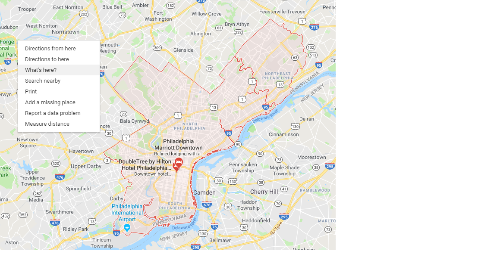

--- 
title: "A Question on the Efficiency of Transit  <br> in Absurd Situations"
author: "Effi Feldblum"
date: "`r Sys.Date()`"
description: Everything you need (and nothing more) to start a bookdown book.
---
```{r, include = FALSE, message= FALSE, warning = FALSE}
# include all packages here if nec.
library(kableExtra)
library(tigris)
philly <- tracts(state = "PA", county = "Philadelphia")

```


# Introduction: The Idea {-}

I was recently in a car with one of my best friends and his new wife[^1] (also a good friend of mine). We were making our way back from our parents joint 4th of July BBQ in Philadelphia towards Washington DC where we had all attended University. These two friends of mine were coming back down to prepare for their fast approaching move to NYC [^2].

Car talk moved towards talking about different public transit systems we've used both around the country and world. Being poor students and recent graduates and all moving in the near future, we are three of us particulary interested in our city's system. This was, of course, mostly complaining about the systems and comparing their negatives. This led me to an, I think, interesting question:

If you were to be dropped in a city at a random point within that cities limit and given another random point to get to, again within the city limits, which city would this be the easiest in?

I will here be trying to begin answering that question. In order to simplify the scope of this exploration, I am limiting myself to looking at New York City, Washington DC, and Philadelphia[^3].


##Plan of Attack 1
###Packages
This analysis will be occuring entirely in R, so the first step is to load up some necessary packages to get started.


```{r, message= FALSE, warning = FALSE}
library(tidyverse)
library(leaflet)

```
###Let's Get Started

The first idea I had in solving this was to create a box around each city, get the longitude-latitude codes of the two corners, then get random points using `points <-  runif(num_points, lower_long/lat_barrier, upper_long/lat_barrier)`.

As an example:
```{r}
x <- data.frame( x= runif(3, 1,50), y = runif(3, 51, 100))
```
```{r, echo=FALSE}
x %>%
  kable() %>%
  kable_styling(bootstrap_options = c("striped", "hover"), full_width = FALSE,
                position = "float_right")
```

Runif will return to us a specified set of random numbers (here `3`) from a uniform distribution. It is a similar function to RandBetween in Excel. You can see the results in the table to the right.  

So, I needed to get approximated bounded corners for the city. The way I decided to do this was to use googlemaps functionality of finding longitude and latitude of any point clicked.

```{r echo=FALSE, out.width = '100%'}


```
```{r echo=FALSE, out.width = '35%'}

```

<br>

So, after some slight maneuvering, we can use the two sets of coordinates to create this:
```{r echo = FALSE}
leaflet(philly) %>%
    addProviderTiles(providers$Stamen.Toner) %>%
  addRectangles(
    lng1=-75.381713, lat1=40.143756,
    lng2=-74.949813, lat2=39.885019, fillColor  = "transparent"
  )%>%
  addPolygons(fillColor = "#8a07ef", weight = 1, smoothFactor = 0.2,
              opacity = 0.5 ,color = "white")

```

Great! Okay, so we can use our coordinate codes of `-75.381713, 40.143756` and `-74.949813, 39.885019` within our `runif` function. As a test, I'll generate 100 random points and map them out. Below I've provided a sample of the points in a table. 

```{r}
longitude <-runif(100, -75.381713, -74.949813)
latitude <- runif(100, 39.885019, 40.143756)
my_df <- data.frame(longitude, latitude)
```

```{r, echo=FALSE}
my_df[1:10,] %>%
  kable() %>%
  kable_styling(bootstrap_options = c("striped"), full_width = FALSE,
                position = "float_right")
```

```{r echo = FALSE}

leaflet(philly) %>%
  addProviderTiles(providers$Stamen.Toner) %>%
  addRectangles(
    lng1=-75.381713, lat1=40.143756,
    lng2=-74.949813, lat2=39.885019, fillColor  = "transparent"
  )%>%
  addPolygons(fillColor = "#8a07ef", weight = 1, smoothFactor = 0.2,
              opacity = 0.5 ,color = "white")%>%
  addCircleMarkers(data=my_df,radius =1.5,
                   color= "#ff0505")

```

## Well Fuck
Clearly this is an issue.  
Cities are not specificially oriented in the plot of the Earth's coordinate system, they are a "random" human choice. Even worse (becuase with motivation, the perspective of the graph can be changed), cities are weird shapes. Humans shaped these amazing metropolises that span whatever land they decide. A very cool thought, but highly inconvenient for me.


*******
[^1]: One of only 3 positions in life that take shotgun seat in front of good friend. The other two being parents and grandparents. 
[^2]: This made the trip much more annoying. In Philadelphia they had purchased a new caspar mattress during a 4th of July sale. My friend had done this forgetting he'd offered me a ride...the mattress and I were quite squished in back seat.
[^3]: The reason for this is purely personal. I had spent the best 10 years of my childhood around Philadelphia. The three of us in the car had attended University of Maryland, and so had used DC public transportation regularly over the last 4 years. Lastly, my friends were two weeks from moving to NYC to start their lives together.